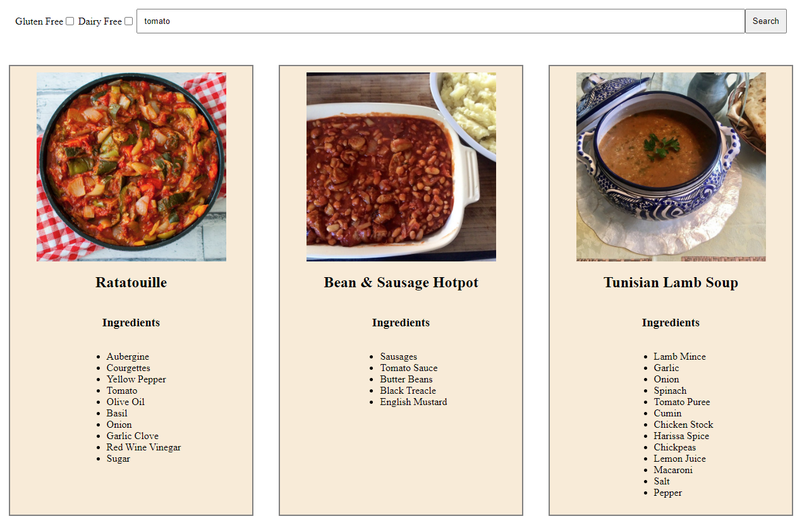
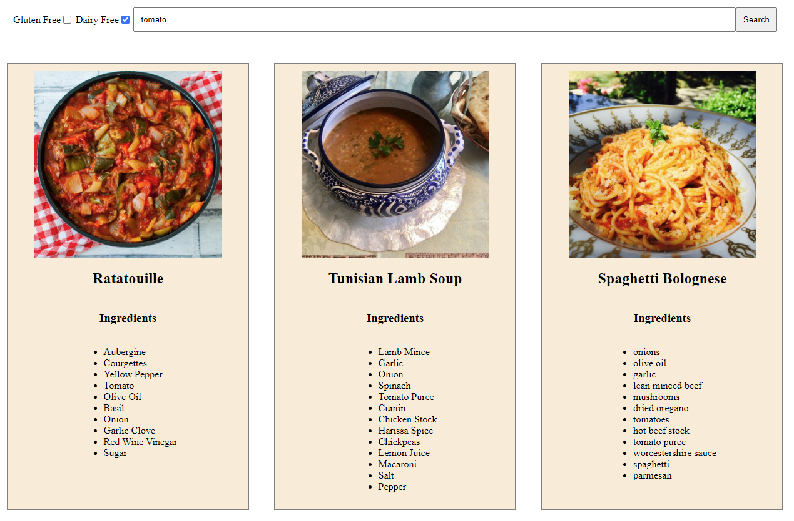

# myProject

## Introduction

A full stack project, displaying recipes from external API and filter it by ingredients and/or sensitivities: dairy and gluten.

    

## Running instructions

### Initialize the DB

inside server/DB/create_db

1. run `createDB.sql`

2. run `create_tables.sql`

3. run `initialize_tables.py`

### run the server

1. run `server.py` inside server folder.
2. on your browser, go to http://localhost:8000/ to see the website.

## Features

The user can filter recipes by 3 parameters:

1. Ingredient name
2. Only recipes which are gluten free
3. Only recipes which are dairy free

    

